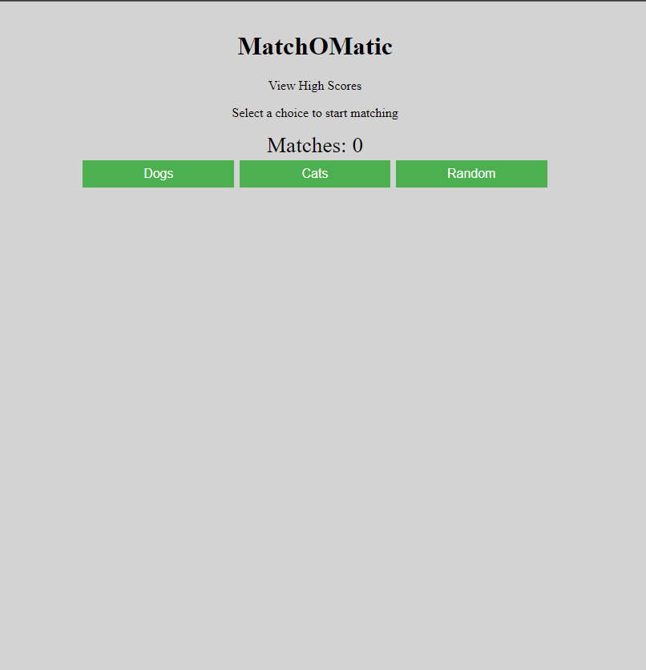
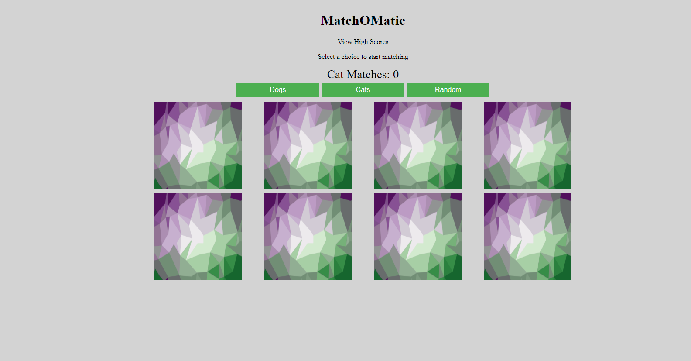
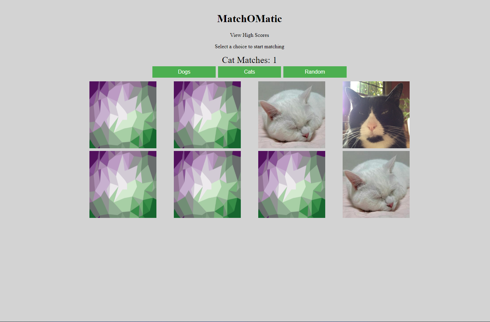
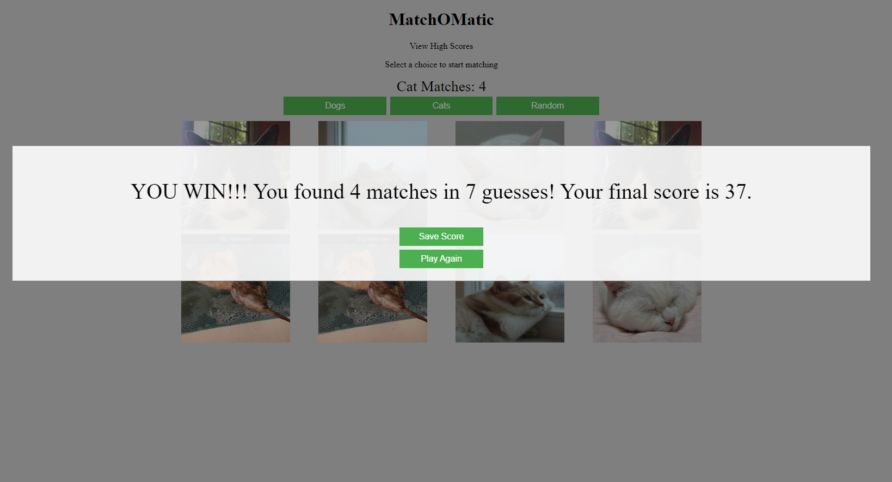
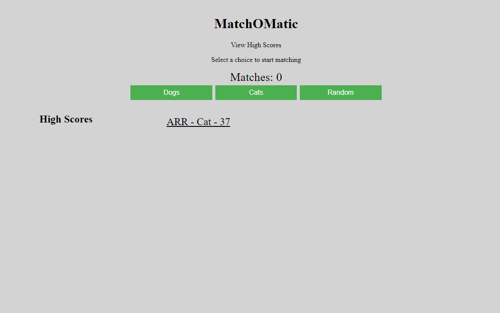

# matchOmatic

 

 ## Description

_Welcome to MatchOMatic, a friendly matching game where a user can pick what types of pictures they would like to match from multiple different API's/datasets. Currently this application is set up to retrieve data from the [DOG API](https://dog.ceo/dog-api/ "DOG link") as well as the [CATS AS A SERVICE (CATAAS) API](https://cataas.com/#/ "CATAAS link")._ 

This application:
* is currently deployed on [GitHub Pages](https://amber-robeck.github.io/matchOmatic/ "GitHub Pages").

---

  ## Table of Contents
  
  - [Usage](#usage)
  - [Installation](#installation)
  - [Screenshots](#screenshots)
  - [License](#license)
  - [Contributions](#how-to-contribute)
  - [Questions](#questions)

  ---

  ## Usage

Currently this application is able to:
* Retrieve data from the [DOG API](https://dog.ceo/dog-api/ "DOG API") and display the pictures as cards.
* Retrieve data from the [CATS AS A SERVICE (CATAAS) API](https://cataas.com/#/ "CATAAS API") and display the pictures as cards.
* Load random data set of images if player chooses random.
* Match the pictures by clicking on the cards.
* Display the number of matches made as a score.
* Let User know they won the game if they have matched all the cards.
* Save initials into local storage for high score.

---

  ## Installation

This project is deployed on [GitHub Pages](https://amber-robeck.github.io/matchOmatic/ "GitHub Pages") and does not need to be installed.

  ---

  ## Screenshots

Here are some screen shots of this application.

    

  ---

  ## License

   MIT License

Copyright (c) [2022] [Amber Robeck]

Permission is hereby granted, free of charge, to any person obtaining a copy
of this software and associated documentation files (the "Software"), to deal
in the Software without restriction, including without limitation the rights
to use, copy, modify, merge, publish, distribute, sublicense, and/or sell
copies of the Software, and to permit persons to whom the Software is
furnished to do so, subject to the following conditions:

The above copyright notice and this permission notice shall be included in all
copies or substantial portions of the Software.

THE SOFTWARE IS PROVIDED "AS IS", WITHOUT WARRANTY OF ANY KIND, EXPRESS OR
IMPLIED, INCLUDING BUT NOT LIMITED TO THE WARRANTIES OF MERCHANTABILITY,
FITNESS FOR A PARTICULAR PURPOSE AND NONINFRINGEMENT. IN NO EVENT SHALL THE
AUTHORS OR COPYRIGHT HOLDERS BE LIABLE FOR ANY CLAIM, DAMAGES OR OTHER
LIABILITY, WHETHER IN AN ACTION OF CONTRACT, TORT OR OTHERWISE, ARISING FROM,
OUT OF OR IN CONNECTION WITH THE SOFTWARE OR THE USE OR OTHER DEALINGS IN THE
SOFTWARE.

  
  ---
  
  ## How to Contribute

However you would like to contribute I always look forward to learning something new, feel free to email me!

  ---

  ## Questions

* OR here

 

* OR here

